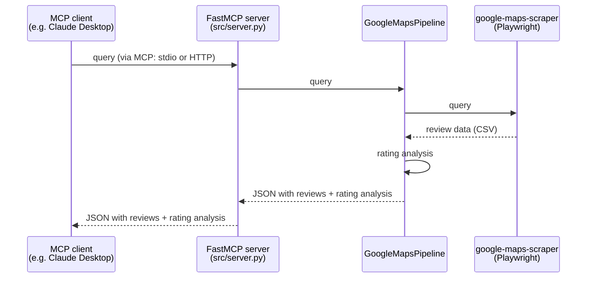

# place-ratings-analyzer

日本語版: [README_ja.md](README_ja.md)

An MCP server that fetches and analyzes Google Maps review ratings — not just the average
star rating, but the **full count breakdown across ★1–★5**. Use it together with an AI
app such as Claude Desktop.

## What is this tool for?

AI apps such as Claude Desktop can already show you a restaurant's reputation as a
number — a "★4.0 average." But that number alone can't tell you whether ratings cluster
around ★4, or split between ★5 and ★1. This server looks up a place's reviews on Google
Maps and gets the actual star-by-star breakdown, then gives you an assessment based on
that pattern. Connect this server to your AI app, and it can investigate more deeply
for you — checking a specific place's reputation, or finding places where ratings are
split.

## Installation

Installing this server takes a bit of computer know-how. If anything below is unclear,
try showing this file to an AI app and asking it questions, or consider using an agentic
feature like Cowork to handle the installation for you.

### Requirements

- This server runs on Docker.
  - On Windows, Docker needs WSL. If you don't have it yet, open PowerShell (or a similar
    terminal) as Administrator and run:
    - `wsl --install`
  - This installs WSL and everything else you need in one step. Once it's done, restart
    Windows.
  - After restarting, open "Ubuntu" from the Start menu. The first launch will ask you to
    create a Linux username and password — pick whatever you like.
- There are two ways to install Docker itself:
  1. Install Docker Desktop.
     - This is the easier route.
     - If you're using it commercially (e.g. at a company), check your license terms —
       some situations require a paid plan.
  2. Install it from the command line on Ubuntu or another Linux environment.
     - Unlike Docker Desktop, this is free for commercial use too. Run:
     - `sudo apt install -y docker.io`
     - Depending on your environment, you may need extra setup beyond this command (e.g.
       adding Docker's own apt repository). See the web or Docker's documentation for
       details.

### Downloading the repository

- Download it either with `git clone`, or as a ZIP file from this repository's page.
- To clone every file correctly on Windows, turn on Windows Developer Mode and add this
  option to `git clone`:
  - `-c core.symlinks=true`
  - Without it, a few of the project's developer-facing features (Agent Skills) are
    limited — the server itself still runs fine.

### Using it from Claude Desktop

Here's how to connect this MCP server to Claude Desktop, a generative-AI app.

First, open a terminal in the folder where you cloned this repository, and run the
following command to build the Docker image.

```bash
docker build -t place-ratings-analyzer .
```

Once the build finishes, register this server in Claude Desktop's config file. The file
lives at:

- Windows: `%APPDATA%\Claude\claude_desktop_config.json`
- Mac: `~/Library/Application Support/Claude/claude_desktop_config.json`

**If `claude_desktop_config.json` doesn't exist yet, or is empty**, create it in a text
editor and paste in exactly this, then save:

```json
{
  "mcpServers": {
    "place-ratings-analyzer": {
      "command": "docker",
      "args": ["run", "-i", "--rm", "--shm-size=1g", "place-ratings-analyzer:latest", "python", "-m", "src.server"]
    }
  }
}
```

**If the file already exists with other settings in it**, add the following block right
after the line that reads `"mcpServers": {`, without deleting anything already there:

```json
"place-ratings-analyzer": {
  "command": "docker",
  "args": ["run", "-i", "--rm", "--shm-size=1g", "place-ratings-analyzer:latest", "python", "-m", "src.server"]
},
```

If you installed Docker directly inside WSL (rather than Docker Desktop) on Windows,
replace `"command"` and `"args"` above with:

```json
"command": "wsl",
"args": ["-e", "docker", "run", "-i", "--rm", "--shm-size=1g", "place-ratings-analyzer:latest", "python", "-m", "src.server"]
```

### Helping your AI app proactively use this tool

So that your AI app (e.g. Claude Desktop) proactively uses this MCP server for restaurant/venue
searches, add an instruction in its settings. In Claude Desktop: **Settings → General →
"Instructions for Claude"**, and add a line such as:

```
Always use the place-ratings-analyzer MCP server (and any related skills) for restaurant/venue
searches.
```

After saving, start a new chat — the tool becomes more likely to be used from that point on.

### Updating

Pulling repository updates (e.g. `git pull`) doesn't change anything running — the server runs
from the Docker image, not the repository files. Rebuild the image and restart Claude Desktop:

```bash
docker build -t place-ratings-analyzer .
```

### [Advanced] [Under development] Running as a remote MCP server

MCP servers can talk to clients in two ways: over stdio (standard I/O), or over
HTTP/HTTPS. The latter is what's called a remote MCP server.

Some AI apps only support connecting to remote MCP servers — but everything up to this
point has only covered the stdio method.

Run the following Docker command to run this server as a remote MCP server instead.

```bash
docker compose up --build   # → reach the server at http://localhost:8888/mcp
```

### [Advanced] Making this reachable from anywhere

Everything above only makes the server reachable from the same machine it runs on. It's
also possible to deploy this server to a cloud host instead, with authentication enabled,
so it can be reached from anywhere — useful for AI apps that only support connecting to a
remote MCP server over the internet.

This repository's own detailed walkthrough for one way to do this (Google Cloud Run, with
Google-account-based access control) lives in `.agents/skills/cloud-run-deploy/`.

Doing this requires some comfort with cloud infrastructure and security concepts —
authentication, access control, and the ongoing cost of a publicly reachable server. It's
squarely your own responsibility to operate safely; treat the linked walkthrough as a
starting point to adapt, not a turnkey setup.

## Architecture

- **`src/pipeline.py`**
  - This server's core (`GoogleMapsPipeline`): searches for reviews, fetches them as CSV,
    and outputs JSON with the rating analysis attached
  - The search logic itself is built on
    [google-maps-scraper](https://github.com/gosom/google-maps-scraper)
- **`src/server.py`**
  - The FastMCP server's entry point

### How a request flows through the server



## Developer tools

- `tools/cli.py`: a lightweight client for smoke-testing the core (`GoogleMapsPipeline`)
  directly
- [CLAUDE.md](CLAUDE.md): the manual for coding agents such as Claude Code
- `.agents/skills/`: a set of Agent Skills covering development steps too detailed for
  CLAUDE.md
  - Mainly written for coding agents to read, but also documents some of the trouble
    encountered during development and how it was resolved — background that's useful
    for human developers too
