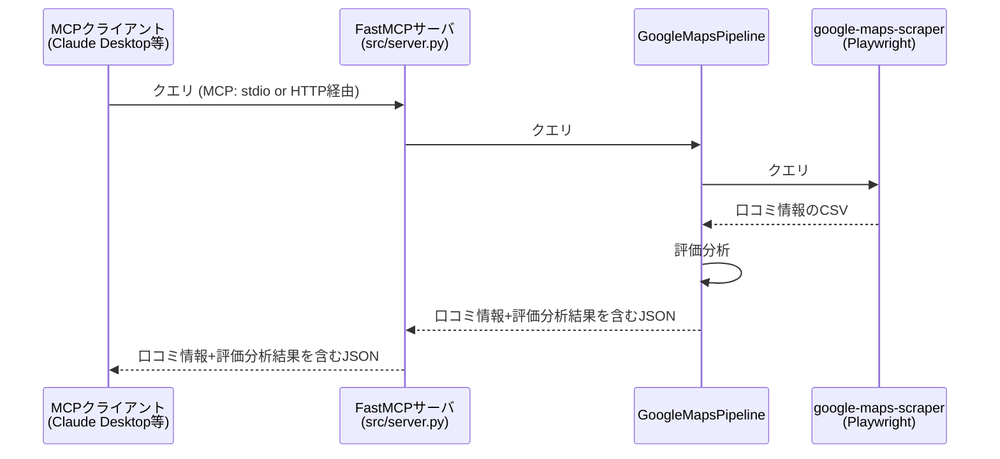

# place-ratings-analyzer

English: [README.md](README.md)

Google マップの口コミ評価を、平均★だけでなく**★1〜★5の件数分布**まで取得・分析する
MCPサーバです。Claude Desktopなどの生成AIクライアントと連携して利用します。

## このツールでできること

Claude Desktopなどの生成AIクライアントは、お店の評判を「平均★4.0点」という数字で示してくれます。
しかしそれだけでは、評価が★4点に集中しているのか、★5点と★1点に割れた結果なのかを区別できません。
このサーバはGoogleマップの口コミを調べて実際の★ごとの内訳を取得し、その傾向に基づく評価を示します。
このサーバを生成AIクライアントに接続すれば、特定の店の評判を確かめたり、評価の割れている店を探したりと
より詳しい調査ができます。

## インストール方法

本サーバのインストールには、パソコン操作に関する知識が多少必要です。
インストール方法に不明点がある場合は本ファイルを生成AIクライアントに見せて質問するか、Coworkのような機能に
インストール作業を代行させることも検討ください。

### 必要環境

- このサーバはDockerで動かします。
  - Windowsの場合、Dockerを動かすのにWSLが必要です。まだ入れてなければ、PowerShellなどのターミナルを
    管理者として開いて、次のコマンドを実行してください。
    - `wsl --install`
  - コマンド実行によりWSLを含む必要な環境一式がまとめて入りますので、その後Windowsを
    再起動してください。
  - 再起動できたらスタートメニューから「Ubuntu」を開いてください。初回起動時なら
    Linux用のユーザー名とパスワードを聞かれるので好きなものを設定してください。
- Dockerのインストールは2通りの方法があります。
  1. Docker Desktopをインストールします。
     - 比較的容易にDockerをインストールできます。
     - ただし、企業などで商用利用する際はライセンス条件を確認してください。場合によっては有償契約が必要になります。
  2. UbuntuなどのLinux環境でコマンドを打ってインストールします。
     - Docker Desktopとは異なり、無償で商用利用できます。インストールには下記のコマンドを打ってください。
     - `sudo apt install -y docker.io`
     - 環境によっては、上記のコマンド以外にもDockerのaptリポジトリの追加などの設定が必要です。その詳しい手順は
       Web検索やDockerに関する文献を参照ください。

### リポジトリのダウンロード

- `git clone`コマンドでダウンロードするか、本リポジトリのページからzipファイルをダウンロードしてください。  
- もしWindows環境で本リポジトリのすべてのファイルをクローンする場合、Windowsの開発者モードをオンにした上で
  以下のオプションをつけて`git clone`を実行する必要があります。
  - `-c core.symlinks=true`
  - オプションをつけなくても、本サーバの開発用の機能(Agent Skills)の一部に制限が生じるのみで、
    サーバ本体の利用に支障はありません。

### Claude Desktopからの連携方法

生成AIクライアントであるClaude Desktopに本MCPサーバを連携する場合の手順を示します。

まず、クローンしたこのリポジトリのフォルダでターミナルを開き、次のコマンドを実行して
Dockerイメージをビルドします。

```bash
docker build -t place-ratings-analyzer .
```

ビルドが終わったら、Claude Desktopの設定ファイルにこのサーバを登録します。設定ファイルは
次の場所にあります。

- Windows: `%APPDATA%\Claude\claude_desktop_config.json`
- Mac: `~/Library/Application Support/Claude/claude_desktop_config.json`

**`claude_desktop_config.json`が所定の場所にまだ無い場合、または中身が空の場合**は、
テキストエディタで新規作成し、次の内容をそのまま貼り付けて保存してください。

```json
{
  "mcpServers": {
    "place-ratings-analyzer": {
      "command": "docker",
      "args": ["run", "-i", "--rm", "--shm-size=1g", "place-ratings-analyzer:latest", "python", "-m", "src.server"]
    }
  }
}
```

**すでにファイルがあり、中に様々な設定が書かれている場合**は、ファイル内の`"mcpServers": {` と
書かれた行の直後に次のブロックの内容をそのまま追加してください。このとき、既存の行の内容は消さないでください。

```json
"place-ratings-analyzer": {
  "command": "docker",
  "args": ["run", "-i", "--rm", "--shm-size=1g", "place-ratings-analyzer:latest", "python", "-m", "src.server"]
},
```

WindowsでWSLから直接dockerをインストールした場合は、上記の`"command"`と`"args"`の内容を以下の通り差し替えてください。

```json
"command": "wsl",
"args": ["-e", "docker", "run", "-i", "--rm", "--shm-size=1g", "place-ratings-analyzer:latest", "python", "-m", "src.server"]
```

### 【発展】【開発中】リモートMCPサーバとして起動する方法

MCPサーバの通信形式にはstdio(標準出力)を用いる方法と、HTTP/HTTPSを用いる方法があります。後者を使ったものをリモートMCPサーバと呼びます。

一部の生成AIクライアントはリモートMCPサーバとの連携のみサポートしていますが、前章までの方法はstdioによる連携しかできません。

下記のDockerのコマンドを実行すれば、本サーバをリモートMCPサーバとして実行できます。

```bash
docker compose up --build   # → http://localhost:8888/mcp にアクセスするとサーバに通信可能
```

## 本サーバのアーキテクチャ

- **`src/pipeline.py`**
  - 本サーバのメイン機能(`GoogleMapsPipeline`)。口コミ情報を検索してCSV形式で取得し、それに応じた評価結果を付与したJSONを出力
  - 検索機能のコアロジックは、[google-maps-scraper](https://github.com/gosom/google-maps-scraper)を利用して実現
- **`src/server.py`**
  - FastMCPサーバのエントリポイントを提供

### 本サーバの処理の大まかな流れ



## 開発者向けツール

- `tools/cli.py`: メイン機能(`GoogleMapsPipeline`)の疎通確認用の簡易クライアント
- [CLAUDE.md](CLAUDE.md): Claude Codeなどのコーディングエージェントが読むマニュアル
- `.agents/skills/`: CLAUDE.mdに書ききれない開発作業の細かな手順を Agent Skills の形式で書き示したファイル一式
  - 主にコーディングエージェントが読むためのものだが、本サーバの開発中に直面したトラブルやその対応の経緯など、人間の開発者の参考となる情報も一部記載
